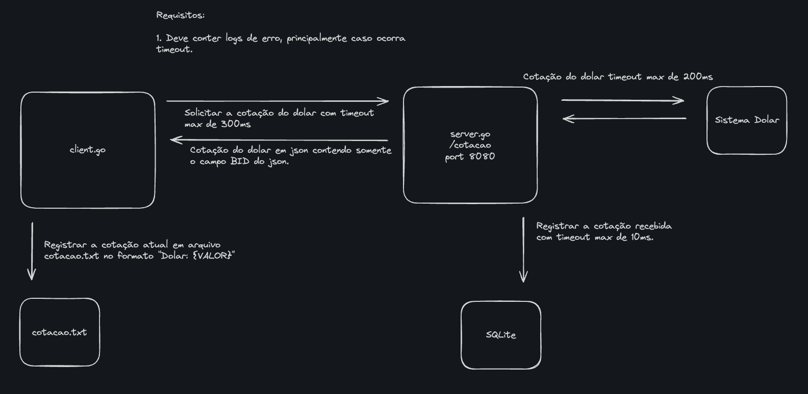

# Desafio proposto:

Neste desafio vamos aplicar o que aprendemos sobre webserver http, contextos,
banco de dados e manipulação de arquivos com Go.
 
Você precisará nos entregar dois sistemas em Go:
- client.go
- server.go
 
Os requisitos para cumprir este desafio são:
 
O client.go deverá realizar uma requisição HTTP no server.go solicitando a cotação do dólar.
 
O server.go deverá consumir a API contendo o câmbio de Dólar e Real no endereço: https://economia.awesomeapi.com.br/json/last/USD-BRL e em seguida deverá retornar no formato JSON o resultado para o cliente.
 
Usando o package "context", o server.go deverá registrar no banco de dados SQLite cada cotação recebida, sendo que o timeout máximo para chamar a API de cotação do dólar deverá ser de 200ms e o timeout máximo para conseguir persistir os dados no banco deverá ser de 10ms.
 
O client.go precisará receber do server.go apenas o valor atual do câmbio (campo "bid" do JSON). Utilizando o package "context", o client.go terá um timeout máximo de 300ms para receber o resultado do server.go.
 
Os 3 contextos deverão retornar erro nos logs caso o tempo de execução seja insuficiente.
 
O client.go terá que salvar a cotação atual em um arquivo "cotacao.txt" no formato: Dólar: {valor}
 
O endpoint necessário gerado pelo server.go para este desafio será: /cotacao e a porta a ser utilizada pelo servidor HTTP será a 8080.

# Estrutura do projeto

.\
├── README.md\
├── client\
│   ├── client.go\
│   └── go.mod\
├── images\
│   └── 01images.png\
└── server\
    ├── go.mod\
    ├── go.sum\
    └── server.go\

# Como rodar:

Clonar o repositório:\
`git clone git@github.com:lucasdpg/FullCycle-goexpert.git`

Acessar o diretorio do server:\
`cd FullCycle-goexpert/Client-Server-API/server/`

Rodar o server:\
`go run server.go`

Acessar o diretorio do client:
`cd ../client/`

Rodar o client:
`go run client.go`
